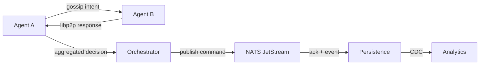

# libp2p + NATS Synergy Patterns

root.solar thrives when decentralized intuition (libp2p) coexists with centralized orchestration (NATS). This guide shows how to compose both fabrics without duplicating effort or creating conflicting sources of truth.

## Division of Labor
| Concern | libp2p | NATS |
| --- | --- | --- |
| Peer discovery & trust negotiation | ✅ | ❌ |
| Command dispatch & persistence | ⚠️ (avoid) | ✅ |
| Gossip & hints | ✅ | ⚠️ (only for observability) |
| Long-term auditability | ⚠️ (metadata only) | ✅ (JetStream) |
| Offline/edge tolerance | ✅ | ⚠️ (needs reconnect logic) |
| Backpressure & load leveling | Peer-specified capability | Stream flow control |

## Choreographing Flows
1. **Intent via libp2p, Commitment via NATS**
   - Agents coordinate tentative allocations over libp2p (`/root-solar/sentiment/1.0.0`).
   - Once consensus is reached, the orchestrator publishes a `root.solar.command.sentiment.set` message to NATS for durable persistence.
2. **Gossip-to-Stream Bridges**
   - Observability scouts listen on libp2p telemetry streams and summarize bursts into NATS telemetry subjects to keep analytics consistent.
3. **Fallbacks & Graceful Degradation**
   - When NATS is unreachable, agents buffer actionable intents over libp2p but mark them as `pending-commit`. Reconcile by replaying buffered messages once NATS recovers.

## Implementation Pattern

## Design Heuristics
- **Single Source of Truth** – The entity that updates SurrealDB or credential ledgers must subscribe to the authoritative NATS stream, even if libp2p initiated the workflow.
- **Latency Budgets** – Use libp2p when humans/agents expect conversational immediacy (<100ms). Use NATS when system invariants demand guaranteed completion (<500ms) with audit trails.
- **Context Tags** – Stamp both libp2p payloads and NATS messages with shared correlation IDs. This unifies tracing across fabrics.

## Testing Checklist
- Simulate partial failures: libp2p up / NATS down, NATS up / libp2p partitioned, both degraded.
- Verify reconciliation scripts can align buffered libp2p intents with persisted NATS commands.
- Run soak tests to ensure message volumes do not exhaust peer buffers or JetStream retention.

## Tooling Support
- `@root-solar/net-sync` (planned package) will expose helpers to bridge libp2p gossip with NATS events.
- Observability dashboards correlate peer health (libp2p) with stream lag (NATS) to visualize system balance.

By designing with both fabrics in mind, we honor the project’s ethos: autonomy without anarchy, orchestration without ossification. Let libp2p handle the sparks of collaboration and NATS anchor the commitments that keep root.solar trustworthy.
